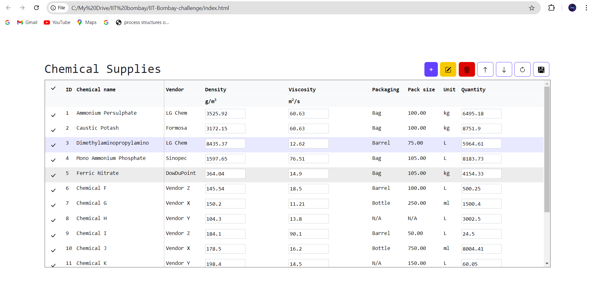

# Documentation

## Design Approach and Choices for Dynamic Table



This document outlines the design approach and choices made in developing the dynamic table interface.


### Directory structure

```
├── index.html
├── index.js
├── styles.css
├── bootstrap.min.css
├── bootstrap.bundle.min.js
└── assets
    ├── pencil-square.svg
    ├── trash3.svg
    ├── arrow-up.svg
    ├── arrow-down.svg
    ├── arrow-clockwise.svg
    ├── floppy-fill.svg
    ├── check-lg.svg
    └── UI.png

```

### Overall Architecture

The application is built using HTML, CSS, and JavaScript, leveraging the Bootstrap framework for styling and modal components.  The data is stored in a JavaScript array (`invoices`) and manipulated using DOM manipulation techniques. Local storage is used to persist changes made to the table.

### Data Management

* **Data Structure:** The table data is stored in a JavaScript array of objects, where each object represents a row with given properties.
* **Initial Data:** The `invoices` array is initialized with sample data.  This data is also deep-copied into `initialInvoices` to allow for resetting the table to its original state.
* **Local Storage:** The `localStorage` API is used to persist table changes. The `saveButton` event listener saves the updated `invoices` array to local storage, and the `refreshButton` loads data from local storage if available, or defaults to `initialInvoices`.

### Table Manipulation

* **Dynamic Row Creation:** The `createTableRows` function dynamically generates table rows based on the `invoices` array.  This function clears existing rows and rebuilds the table each time it's called, ensuring the display is consistent with the data.  Input fields are created for some values to allow for in-place editing.
* **Row Selection:**  Clicking the select button in a row toggles the `selected` class, highlighting the row and enabling related buttons (edit, delete, move up, move down). Only one row can be selected at a time.
* **Adding Rows:** The "New Row" modal allows users to input values for a new row. The `saveNewRow` event listener adds the new invoice object to the `invoices` array and rebuilds the table.
* **Editing Rows:** The "Edit Row" modal allows users to modify the data of the selected row. The `saveEditRow` event listener updates the selected row's data in the DOM and triggers a save to local storage.
* **Deleting Rows:** The `deleteRow` function removes the selected row from both the DOM and the `invoices` array.
* **Moving Rows:** The `moveRowUp` and `moveRowDown` functions move the selected row up or down in the table, updating both the DOM and the `invoices` array to reflect the change.
* **Sorting:** The `sortTable` function sorts the table by the clicked column. It handles ascending and descending order and updates the table display accordingly.

### User Interface

* **Bootstrap:** Bootstrap is used for styling and layout, providing a responsive and visually appealing interface.  Bootstrap modals are used for adding and editing rows.
* **Button States:** The `updateButtonStates` function dynamically enables/disables buttons (delete, move up, move down, edit) based on whether a row is selected and its position in the table.
* **Selected Rows:** The selected row is highlighted using the `selected` class.
